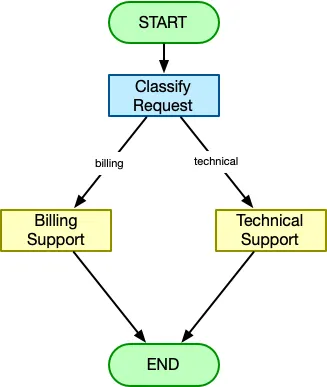
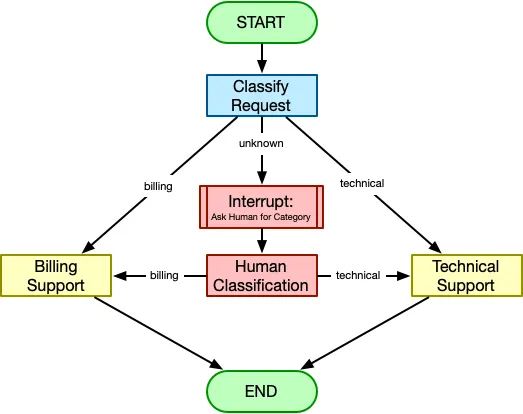

# Building a Graph-Based Agentic Workflow

Foundational Graph components
- Nodes
- Edges
- Conditional transitions and branching
- Workflow state

## Links

- [Source article](https://thetalkingapp.medium.com/spring-ai-recipe-building-a-graph-based-agentic-workflow-becfae64170a)
- [Spring AI Alibaba](https://java2ai.com/)
- [Graph Foundation](https://medium.com/@kiranvutukuri/14-graph-algorithms-for-ai-foundations-understanding-relationships-and-structure-dee5e3b99f2c)

## Overview

A simple graph-based agentic workflow around ChatClient.  
Use Ali-baba's graph to build a graph-based workflow, and Spring AI's ChatClient to interact with LLMs.  
Built on top of Chat Loop (text-based-chat-loop)  




## Use Case

For some circumstances deterministic workflows are better than autonomous planning. Sometimes you want:
- Predictable execution
- Explicit branching logic
- Controlled flow between steps
- or deterministic handling of specific scenarios
That’s where graph-based workflows come in. Rather than allowing the agent to freely decide every step,  
a graph workflow defines an explicit flow of nodes and transitions between those nodes.  
The LLM still plays an important role, but the overall process is guided by a predefined structure.  

## Implementation Details
- Start with chat loop
- Add Alibaba dependencies in build.gradle
- Code Classify Node (ClassifySupportRequestNode)
  - Important details: Code is not driving the classification logic, instead it is just delegating to the LLM.
- Technical Support Node (TechnicalSupportNode)
- Billing Support  Node (BillingSupportNode)
- Building Graph (SupportGraphConfiguration)
- Sample inputs
  - I was overcharged $50
  - My computer screen is frozen
  - Do fish sleep? (Human-in-the-loop)
- Added a human-in-the-loop node to the graph (HumanInTheLoopNode)

## How to Save cost on LLM
To save cost on LLM interactions, you can:

```
Instead of using 
implementation 'org.springframework.ai:spring-ai-starter-model-openai'

use implementation 'org.springframework.ai:spring-ai-starter-model-ollama'

and run it locally.
```

## Fluent API

In Spring AI, chatClient.prompt(messageString) is a shorthand convenience method for simple, single-turn interactions, defaulting the payload as a user message.   
In contrast, chatClient.prompt().user(...) is part of the Spring AI Chat Client fluent API, letting you chain system prompts,   
advisors, and parameters for complex, multi-turn AI workflows.

- [Fluent API Deep Dive](https://dev.to/nk_sk_6f24fdd730188b284bf/understanding-fluent-api-in-spring-a-deep-dive-51lh)

